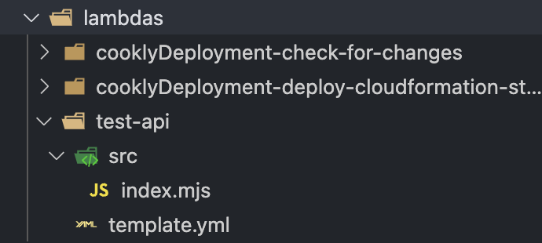

# Overview

This is an overview of how we will be using cloudformation templates using SAM (Serverless Application Model). Below there are some guides on how to format a template, the components of a template and how to modify it to a specific functionality.

---

### CloudFormation

CloudFormation is an Infrastructure as Code (IaC) service provided by AWS that deploys infrastructure to the cloud for you usually via YAML templates.

### SAM (Serverless Application Model)

AWS SAM is an open-source framework developed by AWS for building serverless applications. It extends AWS CloudFormation to offer a simplified way of defining the Amazon API Gateway APIs, AWS Lambda functions, and Amazon DynamoDB tables needed by a serverless application.

---

# How we are using CloudFormation and SAM

## Directories

We are using YAML files to define our resources to be passed to CloudFormation to be deployed.

The file structure of Lambda functions must be as follows:

```
lambdas
└───── {lambda_name}
        └───── src/
                └───── {functionCodeFile}
        └───── template.yml
```

- Where {lambda_name} is the name of the lambda function
- {functionCodeFile} is the actual code for the lambda function. The table below details the names that these files should take depending on the language:

| Language   | File Name            |
| ---------- | -------------------- |
| JavaScript | `index.mjs`          |
| Python     | `lambda_function.py` |

Example:


---

## Template.yml Files

#### Transformations:

CloudFormation templates that use SAM must be transformed from SAM syntax to plain CloudFormation syntax. To do this you need to include some instructions at the top of the template to instruct CloudFormation on how to convert the template.

```yaml
AWSTemplateFormatVersion: "2010-09-09"
Transform: AWS::Serverless-2016-10-31
Description: SAM Template for {lambdaFunction_name}
```

#### Parameters:

CloudFormation templates can be passed parameters that can be used in the template. In all of the templates, the Code Pipeline we use to build these templates passes the current GitHub commit hash to the template so that the template can get the correct version of the code from S3.

```yaml
Parameters:
  CommitHash:
    Description: The commit hash for the Lambda deployment package
    Type: String
```

### Resources:

The resources part of the template is where you define the lambda functions, the versions, the alias's and the APIs.

##### Lambda Function:

```yaml
function: # variable name for the function you are making
  Type: AWS::Serverless::Function 
  Properties:
    CodeUri: # where the source code is stored in S3
      Bucket: !Ref BucketName
      Key: !Sub "${LambdaFunctionName}/${CommitHash}/src.zip"
    FunctionName: {function_name} 
    Handler: {file_name.function_name} # see below
    Description: An AWS Lambda function
    Role: {role_arn} # arn of the role in IAM
    Runtime: {runtime} # either nodejs18.x or python3.11
    Timeout: 3 # number of seconds before lambda function timesout
    MemorySize: 128 # RAM in MB
    Architectures: # always leave as arm64 (uses graviton 2 chip this way)
      - 'arm64'
```

- `file_name.function_name`: the file name of the lambda function and the name of the handler function. 
	- For Python: `lambda_function.function_handler`
	- For JavaScript: `index.handler`

##### Lambda Function Alias's and Versions

```yaml
functionVersion:
  Type: AWS::Lambda::Version
  Properties:
    FunctionName: !Ref function

# Lambda function alias for Development
DevelopmentAlias:
  Type: AWS::Lambda::Alias
  Properties:
    FunctionName: !Ref function
    FunctionVersion: !GetAtt functionVersion.Version 
    Name: "Development" # this is the only bit you have to change
```

##### API
```yaml
# API Gateway setup
Api:
  Type: AWS::ApiGateway::RestApi
  Properties:
    Name: {API-Name}
    Description: Description for the API

# API Gateway resource
ApiResource:
  Type: AWS::ApiGateway::Resource
  Properties:
    RestApiId: !Ref Api
    ParentId: !GetAtt Api.RootResourceId
    PathPart: !Ref ApiResourceName

# API Gateway method
ApiMethod:
  Type: AWS::ApiGateway::Method
  Properties:
    RestApiId: !Ref Api
    ResourceId: !Ref ApiResource
    HttpMethod: {METHOD} # GET, POST, PUT etc. 
    AuthorizationType: "IAM" # If test api that will be deleted use "NONE"
    Integration:
      Type: "AWS"
      IntegrationHttpMethod: "POST" # will usually always be post 
      Uri: !Sub "arn:aws:apigateway:eu-west-2:lambda:path/2015-03-31/functions/${function.Arn}/invocations"
      PassthroughBehavior: "WHEN_NO_MATCH"
      RequestTemplates:
        application/json: '{"statusCode": 200}'
    MethodResponses:
      - StatusCode: "200"
        ResponseModels:
          application/json: "Empty"
```

- Shouldnt have to change most of the API gateway template for most lambda function integrations.